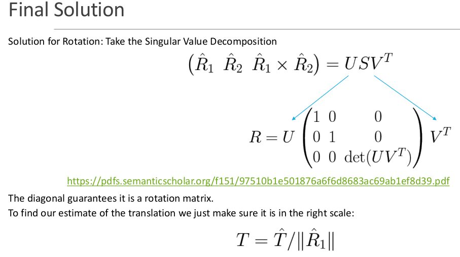

# Drone-Pose-Estimation

### Problem Statement
Given an onboard downward-facing camera, a mat of AprilTags, and an IMU (Inertial Measurement Unit), the task is to compute the pose and velocity of the drone.

### Methodology

   
   
1. **AprilTag Detection and Position Calculation**  
   - Detect AprilTags within the camera’s downward-facing view.
   - associate the detected Tag with the position in the world coordinate system.

2. **Pose Estimation (Position and Orientation)**  
   - Estimate the drone’s pose (position and orientation) using the homography matrix.
     
     
     
     

3. **Feature Detection and Motion Tracking**  
   - Use FAST (Features from Accelerated Segment Test) for feature detection.
   - Track the motion of these features using the KLT (Kanade-Lucas-Tomasi) optical flow algorithm.

4. **Velocity Estimation**  
   - Formulate the motion field equation to estimate the drone’s velocity in the camera frame.
     
     
     

5. **Outlier Rejection with RANSAC**  
   - Use the RANSAC (Random Sample Consensus) algorithm to reject outliers from the data.
   - Refine the estimate of the drone’s velocity for more accurate results.
     

6. **Fusion with IMU Data Using UKF**  
   - Use the Unscented Kalman Filter (UKF) to fuse the velocity and pose estimates from the camera with data from the IMU for better overall accuracy.
     
     
     
      

This process integrates both vision-based methods and IMU readings to achieve robust pose and velocity estimation for the drone in a dynamic environment.

### Result

### Tools
MATLAB

